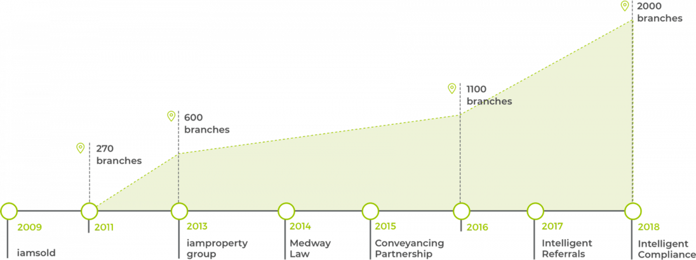

Who are iamproperty? They are a technology company providing services to the estate agency sector. These services include an auction system, conveyancing, compliance as well as a growing range of new services that the team have continually in development. They use the web and mobile technology extensively to serve an expanding customer base of estate agents across the UK that currently number 2000+ branches.

Ross Cooney,  iamproperty's CTO, sums up their offer:

“Our aim is to help property professionals win new instructions and drive extra revenue by developing technology-led software, platforms and services that reduce property transaction timescales whilst increasing productivity and profitability for clients. We also provide choice and control over related 3rd party services and stimulate effective referrals between property professionals to minimise missed revenue opportunities. We also help property professionals identify and fulfil regulatory requirements."

With a value proposition like that, it's not surprising that their growth is nothing short of impressive.
