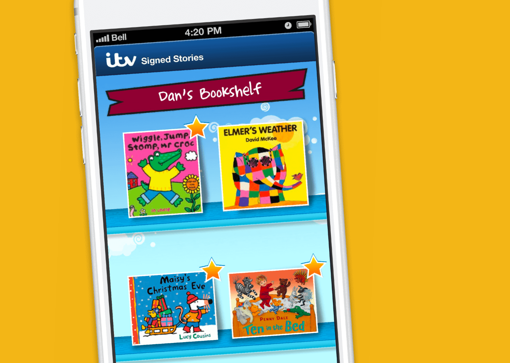

The Signed Stories app was designed from scratch with an easy to use, intuitive navigation that features big touch points so that watching stories and playing games are easy and fun for everyone. Learners can personalise their bookshelf with their own name, and further, customise the look and feel of the app by choosing from one of nine beautifully detailed backgrounds, complete with a selection of brightly coloured characters. 

The app integrates with ITV Signed Stories’ Content Management System which also powers the Signed Stories website. This means that the video files, the book cover and the other assets for each new story only need to be uploaded to the CMS once, streamlining the production and distribution process.

An iPhone version enables reading stories on the move, which can synchronise purchases so that they’re also available across devices. Impressively, there are currently over 100 books available to buy with a choice of either American Sign Language or British Sign Language, with many more on their way!
