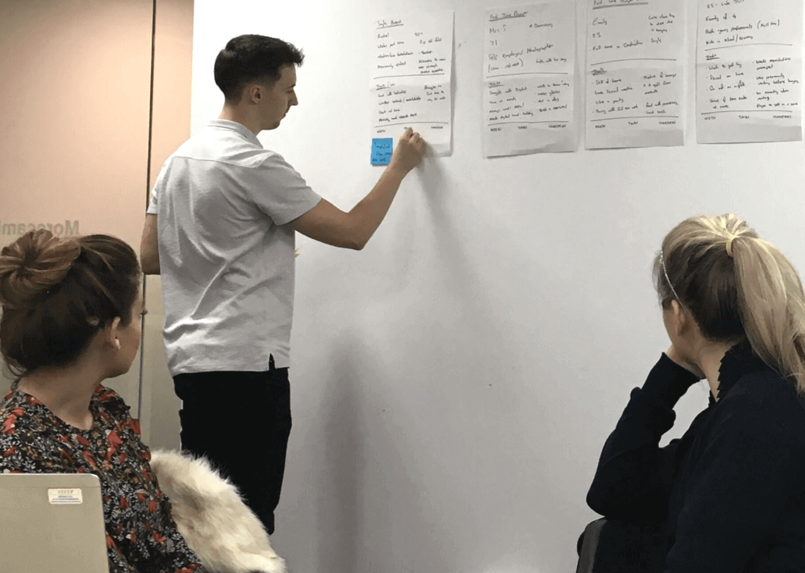
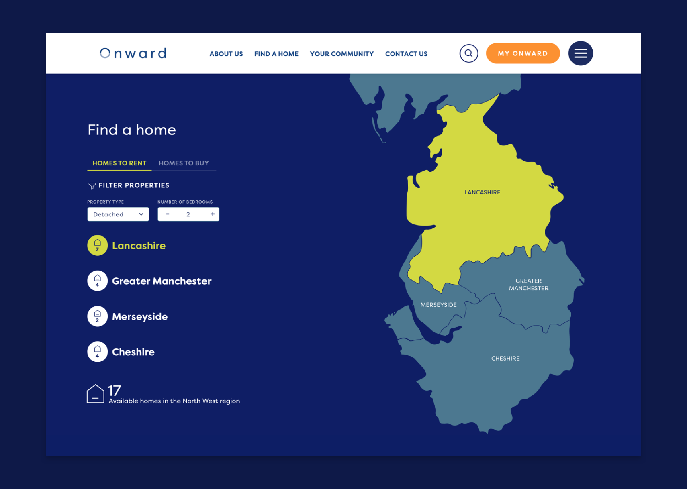

Onward were keen to understand their customers’ requirements and interactions with digital services as part of their wider vision and transformative approach. The resulting discovery workshops and reviews facilitated by our design team helped to inform both the current phase and a view to their plan for the future vision of the digital experience.

Collaboratively producing a set of user stories and acceptance criteria, we were able to map a set of clear and purposeful user flows. Our user centered design process carefully balances the needs of the users with the objectives of the business.

The ‘Find a Home’ experience has been wildly popular for Onward’s customers, with the sheer number of enquiries leading to planned improvements through automation in Phase 2. A unique and dynamic way of searching properties on a range of devices, this feature was our response to bringing together Onward’s housing portfolio from across five different websites.

Since converging their operating processes and restructuring the business, Onward have put the customer at the heart of everything they do. The result is a desire to refocus their digital offering, simplifying the customer journey from website to digital platform. Integrating with Orchard’s Self Service Portal, the new website showcases the benefits of self-service to empower customers to take control of managing their home, payments and repairs.
