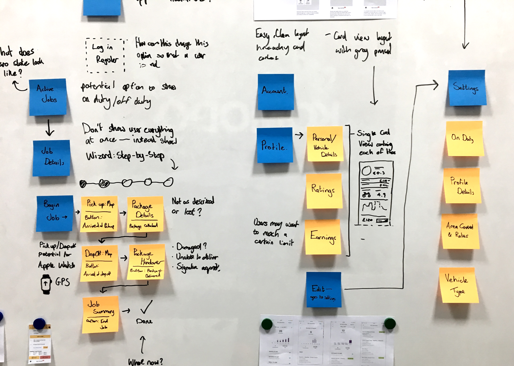

To deliver the full end-to-end courier delivery service, we started by creating detailed user stories and requirements, before expanding this out and architecting the first version of the system. Since then we have iterated on the initial design twice more to get Street Stream to the point we are at today. As part of that the architecture has expanded, becoming more robust to support the increasing service demands of its growing customer base and couriers.

The entire platform comprises of 3 core components, individually designed, architected and supported by the Komodo team. The first being a responsive customer website and service portal. Secondly, a native iOS app for couriers to quote for and manage jobs in real-time. And lastly, a comprehensive admin portal for business analysis.

The unique selling point of Street Stream is undoubtedly its ability to react in real-time. Most courier services function on a daily basis, however, currently none have the capacity to employ bike messaging where the margin of booking time can be immediate. The result of our work is a real time scalable system to support live bidding for work from couriers across London.
