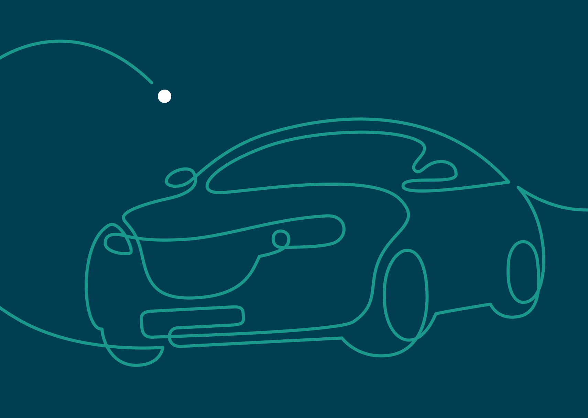
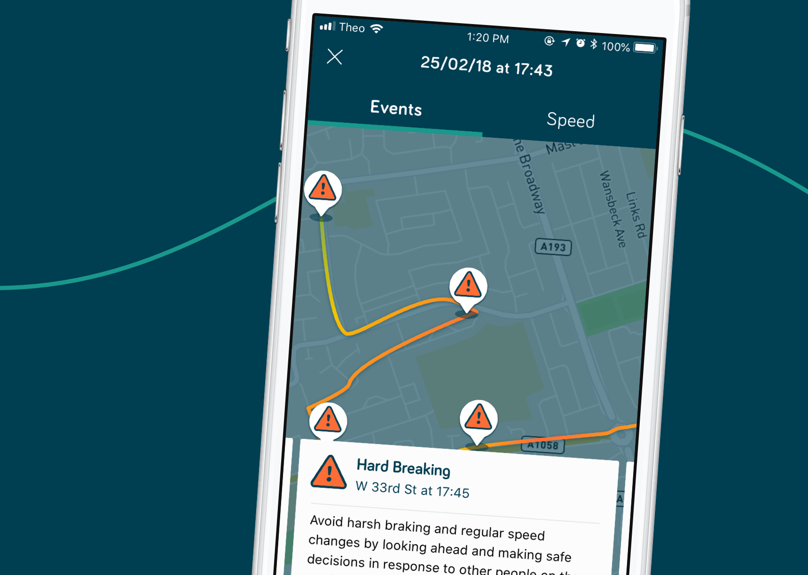

Theo is all about being open, helpful and honest. That’s why it was important for us to make the app’s scoring and driving data easy to read and clear to understand the reasoning behind the scores. The breakdown of scores allows drivers to know what actions to take on their next journey to improve their score. While feature of rewards and incentives provide positive reinforcement to highlight the good in a person’s driving and not make the app a mentally negative experience.

Being a start up company, it’s so important to be able to sell what you’re offering. Not only did we provide our full end-to-end services from user flows all the way to bug testing. We made sure to offer Theo the best by creating them a cross platform react native app, and not just stop design at static screens by bringing the design to life with motion design to bring a higher aesthetic. An extra mile was also pushed to provide marketing materials to aide with sales pitches and app store launches.

Successful delivery of this project came from the collaboration we had between our own development team and Theo’s dev team. Being a part of Theo’s Slack channel, regular contact was made to ensure the project ran along smoothly to meet the benchmarks for testing and launch.
